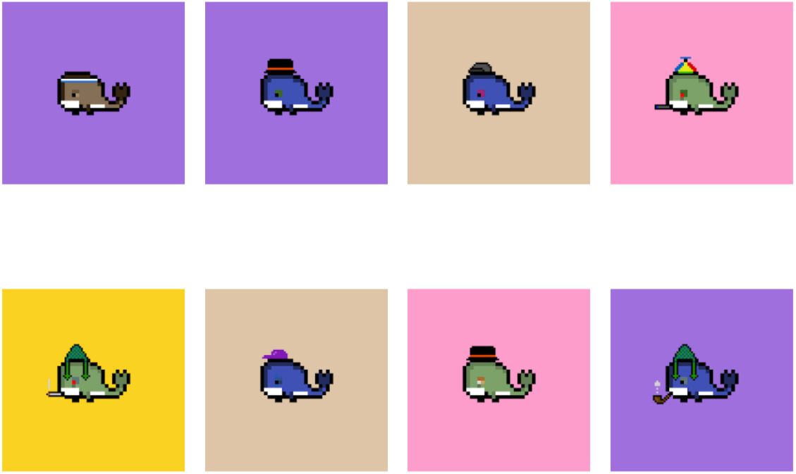

```{r setup, include = F}
rm(list=ls())
knitr::opts_chunk$set(echo = T, warning = F, message = F, cache = T)
```


# Introduction

```{r}
# First, let's load a few useful packages
library(tidyverse)
library(httr)
library(jsonlite)
library(plotly)
library(patchwork)
library(cowplot)
library(network)
library(ggraph)
library(networkDynamic)
library(ndtv)
```

***What is the Blockchain:*** A blockchain is a growing list of records, called blocks, that are linked together using cryptography. It is used for recording transactions, tracking assets, and building trust between participating parties. Primarily known for Bitcoin and cryptocurrencies application, Blockchain is now used in almost all domains, including supply chain, healthcare, logistic, identity management... Hundreds of blockchains exist with their own specifications and applications: Bitcoin, Ethereum, Tezos...

***What are NFTs:*** Non-Fungible Tokens are used to represent ownership of unique items. They let us tokenize things like art, collectibles, even real estate. They can only have one official owner at a time and they're secured by the Blockchain, no one can modify the record of ownership or copy/paste a new NFT into existence. You've probably heard of the artist Beeple who sold one of his NFT art for \$69 million. 

***What is R:*** R language is widely used among statisticians and data miners for developing data analysis software. 

***What is a smart contract:***

This is the second article on a serie on Blockchain. Part I focused on how to read the blockchain and we introduced a few concepts. If you haven't read it, I strongly encourage you to do so to get familiar with the tools and terminology we will use in this part II. 
https://towardsdatascience.com/data-science-on-blockchain-with-r-afaf09f7578c

I very often hear that blockchain is heavily used by Mafia as they are anonymous and confidential. This is only partially true. While we don't know exactly who is behind an address, the transactions made by this address are visible from everyone. And unless you are very careful, it is practically possible to determine the name behind the address by crossing database for example (here are now companies specialized in doing exactly this). 

Let's take the Forbes fortune 400 which ranks the world richest people, I guess you tought it is accurate right? Well it is only an estimation! There isn't actually any precise method to know exactly the richness of people. It is possible that someone is richer than Jeff Bezos but nobody knows it because this fortune is hidden. Blockchain makes it possible to easily track all these things. This is an incredible possibility to make the world more transparent.

We need tools and people able to read, understand, summarize and visualize the blockchain. 
I don't want to have any problem with the mafia so let's focus on a hot topic at the moment: the NFTs.

We will look here at the Weird Whale NFTs. The Weird Whale project is a collection of 3350 whales which have been programmatically generated from an ocean of combinations, each with unique characteristics and different traits: https://weirdwhalesnft.com/. This was created by 12-year-old programmer named Benyamin Ahmed. The 3,350 computer-generated “Weird Whales” almost instantly sold out based on the heartwarming story and Benyamin made more than 400,000\$. Whales were initially sold at approximately 60\$ but since then, there price has been multiplied by 100...  Read this for the whole story: https://www.cnbc.com/amp/2021/08/25/12-year-old-coder-made-6-figures-selling-weird-whales-nfts.html?__twitter_impression=T



# Extracting the data

This section is about downloading the sales data, as well sale prices. It is very interesting but also a bit technical so if you are only interested by the analysis, you can skip this section.

## Transfers

Code of the Weird Whales contract: https://etherscan.io/address/0x96ed81c7f4406eff359e27bff6325dc3c9e042bd#code
To make it easier to extract information from the blockchain (which can be fairly complicated due to how the information is stored on the blockchain), we can read the events. In Solidity, events are dispatched signals the smart contracts can fire. Any app connected to Ethereum network can listen to these events and act accordingly. Here is a list of recent Weird Whales event: https://etherscan.io/address/0x96ed81c7f4406eff359e27bff6325dc3c9e042bd#events

We are particularly interested by the event Transfer. Every time a transfer of NFT will take place, an event will be stored on the blockchain with that structure: Transfer (index_topic_1 address from, index_topic_2 address to, index_topic_3 uint256 tokenId)
Describe...

We will therefore extract all transfer events related to Weird Whales. For this, we can filter on the hash signature of this event (also called Topic 0). If you look on Etherscan (https://etherscan.io/tx/0xa677cfc3b4084f7a5f2e5db5344720bb2ca2c0fe8f29c26b2324ad8c8d6c2ba3#eventlog), you will see that topic 0 for this event is "0xddf252ad1be2c89b69c2b068fc378daa952ba7f163c4a11628f55a4df523b3ef".

Here is an example of a Weird Whale NFT transaction: https://etherscan.io/tx/0x2b21165a60abe3dfdc94d03fd9daa0671dc9b982e8b7fdf6342ed28967c15cfd#eventlog

Here we outline a process to create a databases containing trade data of the Weird Whales. EtherScan limits the number of result per call to 1000. That's not enough to analyze the Weird Whale transactions as only the minting (process of creation of the token on the blockchain) generates 3350 transaction (1 transaction per NFT mint). And that's without all the subsequent transfers! That's why we use a dirty while loop. Note that if you are ready to pay a bit, there are other blockchain database available without restriction. For example, the Ethereum database is available on Google BigQuery.   


```{r eval = F}
# EtherScan requires a token, have a look at their website. Please, use your own token!
EtherScanAPIToken <- "UJP16VCE9D29XFAA86RWADATJ5K4PBSYD9" 

dataEventTransferList <- list()
continue <- 1
i <- 0

while(continue == 1){ # We will run trough the blocks (from the earliest mentioning Weird whales to the latest). As soon ...
  i <- i + 1
  if(i == 1){fromBlock = 12857046} #first block mentioning Weird Whale contract
  
  # Get the transfer events from the Weird Whale contract
  resEventTransfer <- GET("https://api.etherscan.io/api",
                          query = list(module = "logs", 
                                       action = "getLogs", 
                                       fromBlock = fromBlock, #first block mentioning Weird Whale contract
                                       toBlock = "latest",
                                       address = "0x96ed81c7f4406eff359e27bff6325dc3c9e042bd", # address of the Weird Whale contract
                                       topic0 = "0xddf252ad1be2c89b69c2b068fc378daa952ba7f163c4a11628f55a4df523b3ef", # hash of the Transfer event
                                       apikey = EtherScanAPIToken)) 
  
  dataEventTransferList[[i]] <- fromJSON(rawToChar(resEventTransfer$content), flatten = T)$result %>%
    select(-gasPrice, -gasUsed, -logIndex)
  
  if(i > 1){
    if(all_equal(dataEventTransferList[[i]], dataEventTransferList[[i-1]]) == T){continue <- 0}  
  } #at some point, we always download the same last transaction
  
  fromBlock <- max(as.numeric(dataEventTransferList[[i]]$blockNumber)) # increase the block to start looking at for the next iteration
}

dataEventTransfer <- bind_rows(dataEventTransferList) %>% #coerce list to dataframe
  distinct() # eliminate potential duplicated rows due to our trick to avoid the 1000 transaction limitation from EtherScan

# Do a bit of data management
dataEventTransfer <- dataEventTransfer %>% 
  mutate(date = as.POSIXct(as.numeric(timeStamp), origin = "1970-01-01")) %>%
  mutate(topics = purrr::map(topics, setNames, c("eventHash","fromAddress","toAddress","tokenId"))) %>% # it is important to set the names otherwise unnest_wider will print many warning messages.
  unnest_wider(topics) %>% # reshape the topic column (list) to get a column for each topic. 
  mutate(tokenId = as.character(as.numeric(tokenId)), # convert Hexadecmal to numeric
         blockNumber = as.numeric(blockNumber),
         fromAddress = paste0("0x", str_sub(fromAddress,-40,-1)), # reshape the adress format to something more conventional
         toAddress = paste0("0x", str_sub(toAddress,-40,-1))) %>%
  mutate(tokenId = factor(tokenId, levels = as.character(sort(unique(as.numeric(tokenId))))))
```

## Sales price

While both the transfer and the sale can be managed by the same contract, it is a bit different on OpenSea. The sale is managed by the *OpenSea* contract and if it it approved (asked price reached), the contract call the *Weird whale* contract which then triggers the transfer. So if we want to know the price at which the NFTs were sold (in addition to the transfer above), we need to extract data from another contract. 

Note that this loop can take a while to run as we download all the sales prices for all NFT sales on OpenSea, not only the Weird Whale. Knowing that at the time of writing, there were on average 30 transactions per minute on OpenSea, it can take a while to download yes.


```{r eval = F}
# Get the OrderMatch events from the Weird Whale contract
dataEventOrderMatchList <- list()
continue <- 1
i <- 0

while(continue == 1){ # We will run trough the blocks (from the earliest mentioning Weird whales to the latest). As soon ...
  i <- i + 1
  # print(i)
  if(i == 1){fromBlock = 12857046} #first block mentioning Weird Whale contract
  
  
  resEventOrderMatch <- GET("https://api.etherscan.io/api",
                            query = list(module = "logs",
                                         action = "getLogs",
                                         fromBlock = fromBlock, # before that block, transfer event was for minting
                                         toBlock = "latest",
                                         address = "0x7be8076f4ea4a4ad08075c2508e481d6c946d12b", # adress of the Open Sea contract
                                         topic0 = "0xc4109843e0b7d514e4c093114b863f8e7d8d9a458c372cd51bfe526b588006c9", # hash of the OrderMatch event
                                         apikey = EtherScanAPIToken))
  
  dataEventOrderMatchList[[i]] <- fromJSON(rawToChar(resEventOrderMatch$content), flatten = T)$result %>%
    select(-gasPrice, -gasUsed, -logIndex)
  
  if(i > 1){
    if(all_equal(dataEventOrderMatchList[[i]], dataEventOrderMatchList[[i-1]]) == T){continue <- 0}  
  } #at some point, we always download the same last transactions
  
  fromBlock <- max(as.numeric(dataEventOrderMatchList[[i]]$blockNumber)) # increase the block to start looking at for the next iteration
}

dataEventOrderMatch <- bind_rows(dataEventOrderMatchList) %>% #coerce list to dataframe
  distinct() # eliminate potential duplicated rows due to our trick to avoid the 1000 transaction limitation from EtherScan


dataEventOrderMatch <- dataEventOrderMatch %>%
  mutate(date = as.POSIXct(as.numeric(timeStamp), origin = "1970-01-01")) %>%
  mutate(topics = purrr::map(topics, setNames, c("eventHash","fromAddress","toAddress","metadata"))) %>%
  unnest_wider(topics) %>% # reshape the topic column (list) to get a column for each topics
  mutate(blockNumber = as.numeric(blockNumber),
         fromAddress = paste0("0x", str_sub(fromAddress,-40,-1)), # reshape the address format to something more conventional
         toAddress = paste0("0x", str_sub(toAddress,-40,-1))) 

# if you look at the call to the contract, the price is encoded in uint256 type in the data field. It is preceded by two others objects, buyHash and sellHash, both in bytes32 types. The uint256 and bytes32 types are both 32 bytes long, which makes 64 Hexadecimal characters. We thus have to take the last 64 characters and convert them to decimal to get the price.
dataEventOrderMatch <- dataEventOrderMatch %>%
  mutate(priceETH = str_sub(data, start = -64), 
         priceETH = as.numeric(paste0("0x", priceETH)),
         priceETH = priceETH / 10^18) # This is expressed in Wei, the smallest denomination of ether. 1 ether = 1,000,000,000,000,000,000 Wei (10\^18).
```
## Combine the two events 

Let's now merge the two dataset by the transactionHash of the Weird Whales transfers.

```{r, eval = F}
# Merge the transfer and orderMatch events
dataWeirdWhale <- left_join(dataEventTransfer, select(dataEventOrderMatch, priceETH, transactionHash), by = "transactionHash")
# saveRDS(dataWeirdWhale, "data/dataWeirdWhale.rds")
```

## Convert the ETH price in USD

We are working on the Ethereum blockchain. It makes sense that the transaction price are given in ETH. Ethereum / USD rate is highly volatile so if we want to convert ETH to USD, we cannot just apply a multiplicative factor. Since we know the date of transaction, we can just convert using the historical ETH USD price. This time, we won't download the data from EtherScan (you need a pro account for that) but from the Poloniex exchange, which provide a nice API too (and it's free). 

We will use a spline function approximation to smooth and interpolate the conversion rate. The reason is that the resolution of the timestamp of the transaction event is the second while the resolution of the historical price dataset is much lower. We thus need to interpolate.

```{r}
# Download historical price, see https://docs.poloniex.com/#returnchartdata for more information
resHistoricalPrice <- GET("https://poloniex.com/public",
                          query = list(command = "returnChartData",
                                       currencyPair = "USDT_ETH",
                                       start = as.numeric(min(dataWeirdWhale$timeStamp)),
                                       end = as.numeric(max(dataWeirdWhale$timeStamp)),
                                       period = 1800)) # resolution of the dataset. 1800 corresponds to one row for every 30 minutes.

dataHistoricalPrice <- fromJSON(rawToChar(resHistoricalPrice$content), flatten = T)

dataHistoricalPrice <- dataHistoricalPrice %>%
  select(date, weightedAverage) %>% # we need only the price per date
  mutate(date = as.POSIXct(as.numeric(date), origin = "1970-01-01")) %>%
  rename(conversionRate = weightedAverage)

# try the interpolation spline on the historical conversion rates
approx <- approx(x=dataHistoricalPrice$date, 
                 y=dataHistoricalPrice$conversionRate, 
                 xout=seq(min(dataHistoricalPrice$date), 
                          max(dataHistoricalPrice$date), 
                          length.out=1000)) %>%
  bind_rows

# plot the historical conversion rates together with the spline: it works!
ggplot(aes(x = date, y = conversionRate), data = dataHistoricalPrice) + 
  geom_point() + 
  scale_x_datetime(date_breaks = "1 week") +
  geom_line(aes(x = x, y = y), col = "red", data = approx)

# Utiliser approxfun plutôt?
```


## Final dataset

Note that if you didn't manage to download all the data from EtherScan, you can just load the dataset available on the github.

```{r}
dataWeirdWhale <- readRDS("data/dataWeirdWhale.rds")
```


# Descriptive statistics

Here are a few summary descriptive statistics: 
```{r}
# Summary statistics
dataWeirdWhale %>%
  summarise(`Number of transactions` = n(),
            `Unique token` = length(unique(tokenId)),
            `Unique senders` = length(unique(fromAddress)),
            `Unique receivers` = length(unique(toAddress)),
            `Date range` = paste(min(date), max(date), sep = " - "),
            `Days` = max(date) - min(date)
            ) 
```

We can also determine the number of transactions per address. The first address (0x00..) is not really an address, it refers to the minting of the NFTs. If we omit that one, we see that some addresses have been involved in up to 200 transactions! 

```{r}
# Summary statistics by address
tibble(address = c(dataWeirdWhale$fromAddress, dataWeirdWhale$toAddress)) %>%
  group_by(address) %>%
  summarise(`Number of transactions` = n()) %>%
  rename(`Address` = address) %>%
  arrange(desc(`Number of transactions`))
```

Let's now visualize the price transactions, irrespective of the token ID. We see a high variability in the first few days. This is followed by a quieter period and we can observe the beginning of an upward period in the last days of August. This price increase match to an intensive activity on the social media as the creator story become viral. We even see one transaction close to 8 ETH, this corresponds to an increase of 4000\% compared to the initial price of 0.2 ETH!

```{r}
ggplot(aes(x = date, y = price), data = dataWeirdWhale) +
  geom_point() + 
  scale_x_datetime(date_breaks = "1 week") +
  labs(y = "Price (ETH)", x = "Date")
```

# Check this
https://www.nft-stats.com/collection/weirdwhales

# Visualizing the network

Until now, we looked at the transaction prices. The question now is how to visualize the transactions by themselves, knowing that each NFT is unique and needs to be differentiated from the others! Since we have 

A vertex (or node) of a graph is one of the objects that are connected together. The connections between the vertices are called edges (or links). 
There are several packages available on R to plot network, the most famous being *network* and *igraph*. See the References section for a few amazing tutorials on networks. I have a preferences for the *network* package as it gives the possibility to create interactive plots via the *networkDynamic* package. 

We will first create a simple network and plot it using the *ggraph* package. This package brings the *ggplot2* framework to the networks!

```{r, fig.height = 15, fig.width = 15}
# There are too many data to display in a plot. We will subset on the NFTs which are involved in more than 7 transactions.
tokenIdFilter <- dataWeirdWhale %>%
  group_by(tokenId) %>%
  summarise(n = n()) %>%
  filter(n>7)

dataWeirdWhaleFiltered <- dataWeirdWhale %>%
  filter(tokenId %in% tokenIdFilter$tokenId) %>%
  droplevels()

dataWeirdWhaleFiltered <- dataWeirdWhaleFiltered %>%
  mutate(dateHour = round.POSIXt(date, "hour")) %>% # The time resolution is seconds. That's nice but it leads to a lot of computation (frames) for our network. Let's round to hours.
  mutate(dateHourNumeric = as.numeric(dateHour)/3600) %>%
  mutate(dateHourNumeric = dateHourNumeric-min(dateHourNumeric))  

# vertices is a listing of all the addresses involved in the transactions   
vertices <- tibble(label = unique(c(dataWeirdWhaleFiltered$fromAddress,
                                           dataWeirdWhaleFiltered$toAddress))) %>%
  rowid_to_column("id") %>% # instead of using the addresses to visually identify the vertices, we will use shorter ID numbers 
  mutate(onset = 0, 
         terminus = max(dataWeirdWhaleFiltered$dateHourNumeric))

# edges is a listing of the transactions
edges <- dataWeirdWhaleFiltered %>%
  left_join(vertices, by = c("fromAddress" = "label")) %>% 
  rename(from = id) %>%
  left_join(vertices, by = c("toAddress" = "label")) %>%
  rename(to = id) 

# This will be useful to create a temporal dynamic network later on. Edges will appear at `onset` and disappear at `terminus.`
edges <- edges %>%
  rename(onset = dateHourNumeric) %>% 
  mutate(terminus = max(onset), #  
         tokenId = as.character(tokenId)) %>%
  select(from, to, onset, terminus, tokenId) 

# create the network using network
network <- network(edges,  
                  vertex.attr = vertices, 
                   matrix.type = "edgelist", 
                loops = T, 
                multiple = T, 
                ignore.eval = F)

pNetwork <- ggraph(network) + 
  geom_edge_fan(aes(color = tokenId), arrow = arrow(length = unit(6, "pt"), type = "open")) +
  geom_node_point(color = "black", size = 4) +
  theme_void() +
  geom_node_text(aes(label = id), color = "gold", size = 2, fontface = "bold") 
pNetwork

# create a dynamic temporal network
dNetwork <- networkDynamic(edge.spells = as.data.frame(edges[,c("onset", "terminus", "from", "to", "tokenId")]),
                           vertex.spells = as.data.frame(vertices[,c("onset", "terminus", "id", "label")]),
                           create.TEAs = T)

# plot(network)
compute.animation(dNetwork, 
                  animation.mode = 'MDSJ',
                  slice.par = list(interval = 50, 
                                 start = 1, 
                                 end = max(edges$terminus), 
                                 aggregate.dur = 50, 
                                 rule = 'any'),
                  verbose = F)

timeline(dNetwork)

# plot(dNetwork,
#      edge.label=(dNetwork %e% 'tokenId.active'),
#      edge.label.col='blue') 

render.d3movie(dNetwork, 
               output.mode = 'htmlWidget',
               vertex.tooltip = paste("<b>Address:</b>", (network %v% 'label')),
               edge.tooltip = paste("<b>TokenId:</b>", (network %e% 'tokenId')),
               # displaylabels = T,
               launchBrowser = T,
               main = 'Ethereum transactions of Weird Whales NFTs',
               # edge.col = function(slice){slice%e%'tokenId.active'},
               # edge.label = function(slice){slice%e%'tokenId.active'},
               usearrows = T,
               verbose = F)

```

# Conclusion

so...

**Note that the code used to generate this article is available on my Github: https://github.com/tdemarchin/DataScienceOnBlockchainWithR-PartII**

**If you want to help us continue working on blockchain, don't hesitate to donate to our Ethereum address 0xf5fC137E7428519969a52c710d64406038319169 or Tezos address tz1ffZLHbu9adcobxmd411ufBDcVgrW14mBd**

# References

<https://etherscan.io/>

<https://ethereum.org/en/nft>

<https://www.r-bloggers.com/>

Network:

<https://kateto.net/network-visualization>

<https://www.jessesadler.com/post/network-analysis-with-r/>

<https://programminghistorian.org/en/lessons/temporal-network-analysis-with-r>

<https://ggraph.data-imaginist.com/index.html>
