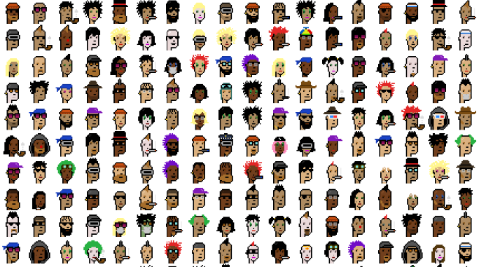

```{r setup, include=FALSE}
rm(list=ls())
knitr::opts_chunk$set(echo = TRUE, warning=FALSE, message=FALSE)
```



# Introduction

```{r}
# First, let's load a few useful packages
library(tidyverse)
library(httr)
library(jsonlite)
library(plotly)
```


How to make the blockchain more transparent? Money laundering,...

Code of the CryptoPunk contract: https://etherscan.io/address/0xb47e3cd837ddf8e4c57f05d70ab865de6e193bbb#code

Structure of the event:
    event Assign(address indexed to, uint256 punkIndex);
    event Transfer(address indexed from, address indexed to, uint256 value);
    event PunkTransfer(address indexed from, address indexed to, uint256 punkIndex);
    event PunkOffered(uint indexed punkIndex, uint minValue, address indexed toAddress);
    event PunkBidEntered(uint indexed punkIndex, uint value, address indexed fromAddress);
    event PunkBidWithdrawn(uint indexed punkIndex, uint value, address indexed fromAddress);
    event PunkBought(uint indexed punkIndex, uint value, address indexed fromAddress, address indexed toAddress);

Interesting events:


topics[0] is the hash of the event signature
 
PunkBought(punkIndex, msg.value, seller, msg.sender);
  topic0 = 0x58e5d5a525e3b40bc15abaa38b5882678db1ee68befd2f60bafe3a7fd06db9e3

// Transfer ownership of a punk to another user without requiring payment
PunkTransfer(msg.sender, to, punkIndex)
  topic0 = 0x05af636b70da6819000c49f85b21fa82081c632069bb626f30932034099107d8


# Tracking the CryptoPunk NFTs


```{r}
# # EtherScan requires a token, have a look at their website. Please, use your own token!
# EtherScanAPIToken <- "UJP16VCE9D29XFAA86RWADATJ5K4PBSYD9" 
# 
# resEtherScanPunkBought <- GET("https://api.etherscan.io/api",
#           query = list(module="logs", 
#                        action="getLogs", 
#                        # fromBlock="0",
#                        # toBlock="latest",
#                        address="0xb47e3cd837dDF8e4c57F05d70Ab865de6e193BBB",
#                        topic0="0x58e5d5a525e3b40bc15abaa38b5882678db1ee68befd2f60bafe3a7fd06db9e3", # Hash of the PunkBought event
#                        sort="desc",
#                        apikey=EtherScanAPIToken)) 
# 
# dataEtherScanPunkBought <- fromJSON(rawToChar(resEtherScanPunkBought$content), flatten=TRUE)$result
# 
# dataEtherScanPunkBought2 <- dataEtherScanPunkBought %>% 
#   mutate(timeStamp=as.POSIXct(as.numeric(timeStamp), origin="1970-01-01")) %>%
#   unnest_wider(topics) %>% # reshape the topic column (list) to get a column for each topics
#   rename(`eventHash`=`...1`, #rename as original naming is not very practical
#          `punkIndex`=`...2`,
#          `fromAddress`=`...3`,
#          `toAddress`=`...4`,
#          `value`=`data`) %>%
#   mutate(value=as.numeric(value) / 10^18, # convert first Hexadecimal to numeric and then Wei to ETH
#          punkIndex=as.numeric(punkIndex), # convert Hexadecmal to numeric
#          fromAddress=paste0("0x", str_sub(fromAddress,-40,-1)), # reshape the adress format to something more conventional
#          toAddress=paste0("0x", str_sub(toAddress,-40,-1)))

# It is possible to transfer without payement but let's first focus on the real sales.
# resEtherScanPunkTransfer <- GET("https://api.etherscan.io/api",
#           query = list(module="logs", 
#                        action="getLogs", 
#                        fromBlock="0",
#                        toBlock="latest",
#                        address="0xb47e3cd837dDF8e4c57F05d70Ab865de6e193BBB",
#                        topic0="0x05af636b70da6819000c49f85b21fa82081c632069bb626f30932034099107d8",
#                        sort="desc",
#                        apikey=EtherScanAPIToken)) 
# 
# dataEtherScanPunkTransfer <- fromJSON(rawToChar(resEtherScanPunkTransfer$content), flatten=TRUE)$result


```

# Tracking the Weird Whales

The Weird Whales project is a collection of 3350 whales which have been programmatically generated from an ocean of combinations, each with unique characteristics and different traits: https://weirdwhalesnft.com/. This was created by 12-year-old programmer named Benyamin Ahmed. The 3,350 computer-generated “Weird Whales” almost instantly sold out based on the heartwarming story and Benyamin made more than 150,000\$. Whales were initially sold at approximately 60\$ but since then, there price has been multiplied by 100...  

## Downloading the NFTs

```{r}
# Retrieve sold NFTs 
sequenceTokenIds <- seq(1, 3350, by=50)
dataOpenSea <- list()

# The API is limited to 50 observation per call. We have to use a loop to retrieve the 3350 items of the Weird whale collection.
for(i in 1:length(sequenceTokenIds)){
  print(sequenceTokenIds[i])
  
  # These 2 steps are necessary to build the "token_ids" part of the URL. 
  # We can't use the GET "query" option as we need to push an array of token_ids and there is no easy way to do that with that option.
  tokenIds <- seq(from=sequenceTokenIds[i], to=sequenceTokenIds[i]+49)
  requestTokenIds <- paste0("token_ids=", tokenIds, collapse="&")
  request <- paste0("https://api.opensea.io/api/v1/assets?limit=50&asset_contract_address=0x96ed81c7f4406eff359e27bff6325dc3c9e042bd&", requestTokenIds) #build the request URL
  resOpenSea <- GET(request)
  dataOpenSea[[i]] <- fromJSON(rawToChar(resOpenSea$content), flatten=TRUE)[[1]] 
}

dataOpenSea <- bind_rows(dataOpenSea) %>% #combine the list in a dataframe
  mutate(token_id = as.numeric(token_id)) %>%
  arrange(token_id)

# Download the pictures
for(i in 1:nrow(dataOpenSea)){
  print(paste("Downloading image:", i))
  download.file(url = dataOpenSea$image_preview_url[i], #let's just download the preview, their size is small and resolution is fine for our needs
                destfile = paste0("figures/WeirdWhales/", 
                                  dataOpenSea$token_id[i], '.png'), 
                mode = 'wb',
                quiet = TRUE)
}

library(patchwork)
samples <- sample(c(1:max(dataOpenSea$token_id)), size=8)
p1 <- ggdraw() + draw_image(paste0("figures/WeirdWhales/", samples[1], ".png"), scale = 0.9)
p2 <- ggdraw() + draw_image(paste0("figures/WeirdWhales/", samples[2], ".png"), scale = 0.9)
p3 <- ggdraw() + draw_image(paste0("figures/WeirdWhales/", samples[3], ".png"), scale = 0.9)
p4 <- ggdraw() + draw_image(paste0("figures/WeirdWhales/", samples[4], ".png"), scale = 0.9)
p5 <- ggdraw() + draw_image(paste0("figures/WeirdWhales/", samples[5], ".png"), scale = 0.9)
p6 <- ggdraw() + draw_image(paste0("figures/WeirdWhales/", samples[6], ".png"), scale = 0.9)
p7 <- ggdraw() + draw_image(paste0("figures/WeirdWhales/", samples[7], ".png"), scale = 0.9)
p8 <- ggdraw() + draw_image(paste0("figures/WeirdWhales/", samples[8], ".png"), scale = 0.9)
p1 + p2 + p3 + p4 + p5 +p6 + p7 + p8 + plot_layout(nrow = 2)
```


Here is an example of a Weird Whale NFT transaction: https://etherscan.io/tx/0x2b21165a60abe3dfdc94d03fd9daa0671dc9b982e8b7fdf6342ed28967c15cfd#eventlog


```{r}
# EtherScan requires a token, have a look at their website. Please, use your own token!
EtherScanAPIToken <- "UJP16VCE9D29XFAA86RWADATJ5K4PBSYD9" 

# Get the transfer events from the Weird Whale contract
resWeirdWhaleTransfer <- GET("https://api.etherscan.io/api",
          query = list(module="logs", 
                       action="getLogs", 
                       fromBlock="12859414", # before that block, transfer event was for minting
                       # fromBlock="12857046", #first block mentionning Weird Whale contract
                       toBlock="latest",
                       address="0x96ed81c7f4406eff359e27bff6325dc3c9e042bd", # address of the Weird Whale contract
                       topic0="0xddf252ad1be2c89b69c2b068fc378daa952ba7f163c4a11628f55a4df523b3ef", # hash of the Transfer event
                       sort="desc",
                       apikey=EtherScanAPIToken)) 

dataWeirdWhaleTransfer <- fromJSON(rawToChar(resWeirdWhaleTransfer$content), flatten=TRUE)$result %>%
  select(-gasPrice, -gasUsed, -logIndex)

dataWeirdWhaleTransfer <- dataWeirdWhaleTransfer %>% 
  mutate(timeStamp=as.POSIXct(as.numeric(timeStamp), origin="1970-01-01")) %>%
  unnest_wider(topics) %>% # reshape the topic column (list) to get a column for each topics
  rename(`eventHash`=`...1`, #rename as original naming is not very practical
         `fromAddress`=`...2`,
         `toAddress`=`...3`,
         `tokenId`=`...4`,
         `value`=`data`) %>%
  mutate(tokenId=as.character(as.numeric(tokenId)), # convert Hexadecmal to numeric
         blockNumber=as.numeric(blockNumber),
         fromAddress=paste0("0x", str_sub(fromAddress,-40,-1)), # reshape the adress format to something more conventional
         toAddress=paste0("0x", str_sub(toAddress,-40,-1))) %>%
  mutate(tokenId = factor(tokenId, levels=as.character(sort(unique(as.numeric(tokenId))))))

tokenIdFilter <- dataWeirdWhaleTransfer %>%
  group_by(tokenId) %>%
  summarise(n = n()) %>%
  filter(n>1)

dataWeirdWhaleTransferFiltered <- filter(dataWeirdWhaleTransfer, tokenId %in% tokenIdFilter$tokenId) %>%
  droplevels()
# pScatterWeirdWhaleTransfer <- ggplot(aes(x=timeStamp, y=tokenId, group=tokenId, text=tokenId), data = dataWeirdWhaleTransferFiltered) +
#   geom_point() + geom_line()
# pScatterWeirdWhaleTransfer <- ggplotly(pScatterWeirdWhaleTransfer, tooltip = "text")

#https://plotly-r.com/supplying-custom-data.html/
#Encode the images directly in the object 
dataWeirdWhaleTransferFiltered$image <- purrr::map_chr(
  dataWeirdWhaleTransferFiltered$tokenId, ~ base64enc::dataURI(file = sprintf("figures/WeirdWhales/%s.png", .x))
)

# create the plotly with the embedded NFT image
plot_ly(type = 'scatter',
        x = ~timeStamp, 
            y = ~tokenId, 
            customdata = ~image, 
            text = ~ paste0("Token ID: ", tokenId), 
            hoverinfo = 'text',
            mode = "lines+markers", 
            split = ~tokenId,
            data = dataWeirdWhaleTransferFiltered) %>%
  htmlwidgets::onRender(readLines("js/tooltip-image.js")) # this script allows to embed the NFT image when hoovering a point
```

Network graph: 
https://www.jessesadler.com/post/network-analysis-with-r/
https://programminghistorian.org/en/lessons/temporal-network-analysis-with-r
https://www.r-graph-gallery.com/network-interactive.html
https://christophergandrud.github.io/networkD3/

To do: https://kateto.net/network-visualization 

```{r}
# sources <- dataWeirdWhaleTransfer %>%
#   distinct(fromAddress) %>%
#   rename(label = fromAddress)
# 
# destinations <- dataWeirdWhaleTransfer %>%
#   distinct(toAddress) %>%
#   rename(label = toAddress)
# nodes <- full_join(sources, destinations, by = "label") %>%
#   rowid_to_column("id")
# 
# 
# edges <- dataWeirdWhaleTransfer %>%
#   left_join(nodes, by = c("fromAddress" = "label")) %>%
#   rename(from = id)
# 
# edges <- edges %>%
#   left_join(nodes, by = c("toAddress" = "label")) %>%
#   rename(to = id)
# 
# edges <- select(edges, from, to, tokenId) %>%
#   filter(tokenId %in% tokenIdFilter$tokenId)
# 
# # library(tidygraph)
# library(igraph)
# library(networkD3)
# p <- simpleNetwork(edges, height="100px", width="100px")
# 
# p2 <- forceNetwork(Links = edges, Nodes = nodes,
#             Source = "from", Target = "to",
#             NodeID = "id",
#             Group = "id", opacity = 0.8)
# p2
# 
# # create the network object
# network <- graph_from_data_frame(d=edges, directed=F)
# plot(network, vertex.size=1, edge.arrow.width=1)
# 
# # plot it
# plot(network)
# 
# # network <- graph_from_data_frame(d=edges, vertices=nodes, directed=F)
# 
# 
# 
# routes_tidy <- tbl_graph(nodes = nodes, edges = edges, directed = TRUE)
# # ggraph(routes_tidy) + geom_edge_link() + geom_node_point() + theme_graph()
# 
# ggraph(routes_tidy, layout = "graphopt") +
#   geom_node_point() +
#   geom_edge_link(aes(), alpha = 0.8) +
#   scale_edge_width(range = c(0.2, 2)) +
#   geom_node_text(aes(label = label), repel = TRUE) +
#   labs(edge_width = "N") +
#   theme_graph()

library(networkDynamic)
library(ndtv)

dataWeirdWhaleTransferFiltered <- dataWeirdWhaleTransferFiltered %>%
  mutate(timeStampNumeric = as.numeric(timeStamp)) %>%
  mutate(timeStampNumeric = timeStampNumeric-min(timeStampNumeric))  

sources <- dataWeirdWhaleTransferFiltered %>%
  distinct(fromAddress) %>%
  rename(label = fromAddress)

destinations <- dataWeirdWhaleTransferFiltered %>%
  distinct(toAddress) %>%
  rename(label = toAddress)

nodes <- full_join(sources, destinations, by = "label") %>%
  rowid_to_column("id")

edges <- dataWeirdWhaleTransferFiltered %>%
  left_join(nodes, by = c("fromAddress" = "label")) %>%
  rename(from = id) %>%
  left_join(nodes, by = c("toAddress" = "label")) %>%
  rename(to = id)

edges <- edges %>% 
  rename(onset = timeStampNumeric) %>%
  mutate(terminus = max(onset)) %>%
  select(from, to, tokenId, onset, terminus) 

firstAppearanceNodes <- rbind(data.frame(id=edges$from, onset=edges$onset),
                              data.frame(id=edges$to, onset=edges$onset)) %>%
  group_by(id) %>%
  summarise(onset = min(onset))

nodes <- nodes %>%
  mutate(terminus = max(edges$terminus)) %>%
  left_join(firstAppearanceNodes)

network <- networkDynamic(edge.spells = as.matrix(edges[,c(4,5,1,2)]), 
                           vertex.spells = as.matrix(nodes[,c(4,3,1)])
                           )

# plot(network)
compute.animation(network, 
                  slice.par=list(interval=50, 
                                 start = 0, 
                                 end = max(edges$terminus), 
                                 aggregate.dur = 1, 
                                 rule='latest')
                  )

render.d3movie(network, output.mode = 'htmlWidget')
```


```{r}
# # Get the OrderMatch events from the Weird Whale contract
# resOpenSeaOrderMatch <- GET("https://api.etherscan.io/api",
#           query = list(module="logs", 
#                        action="getLogs", 
#                        fromBlock="12859414", # before that block, transfer event was for minting
#                        toBlock="latest",
#                        address="0x7be8076f4ea4a4ad08075c2508e481d6c946d12b", # adress of the Open Sea contract
#                        topic0="0xc4109843e0b7d514e4c093114b863f8e7d8d9a458c372cd51bfe526b588006c9", # hash of the OrderMatch event
#                        sort="desc",
#                        apikey=EtherScanAPIToken)) 
# 
# dataOpenSeaOrderMatch <- fromJSON(rawToChar(resOpenSeaOrderMatch$content), flatten=TRUE)$result %>%
#   select(-gasPrice, -gasUsed, -logIndex)
# 
# dataOpenSeaOrderMatch <- dataOpenSeaOrderMatch %>% 
#   mutate(timeStamp=as.POSIXct(as.numeric(timeStamp), origin="1970-01-01")) %>%
#   unnest_wider(topics) %>% # reshape the topic column (list) to get a column for each topics
#   rename(`eventHash`=`...1`, #rename as original naming is not very practical
#          `fromAddress`=`...2`,
#          `toAddress`=`...3`,
#          `metadata`=`...4`,
#          `data`=`data`) %>%
#   mutate(blockNumber=as.numeric(blockNumber),
#          fromAddress=paste0("0x", str_sub(fromAddress,-40,-1)), # reshape the adress format to something more conventional
#          toAddress=paste0("0x", str_sub(toAddress,-40,-1)))
# 
# a <- left_join(dataWeirdWhaleTransfer, dataOpenSeaOrderMatch, by="transactionHash")
# 
# 
# hex_string <- "0x00000000000000000000000000000000000000000000000000000000000000006cb5c489ae0fd5b83bc8ac37481e9e76e1d0cf763e3f03daa06ad581ef74a5240000000000000000000000000000000000000000000000000058d15e17628000"
# library(stringr)
# str_sub(hex_string, 64, 0)
# 
# library(wkb)
# hex_raw <- wkb::hex2raw(hex_string)
# text <- rawToChar(as.raw(strtoi(hex_raw, 16L)))
# # now i can get the rensaction price by merging with the OrderMatch event from the address 0x7be8076f4ea4a4ad08075c2508e481d6c946d12b https://etherscan.io/tx/0x2b21165a60abe3dfdc94d03fd9daa0671dc9b982e8b7fdf6342ed28967c15cfd#eventlog